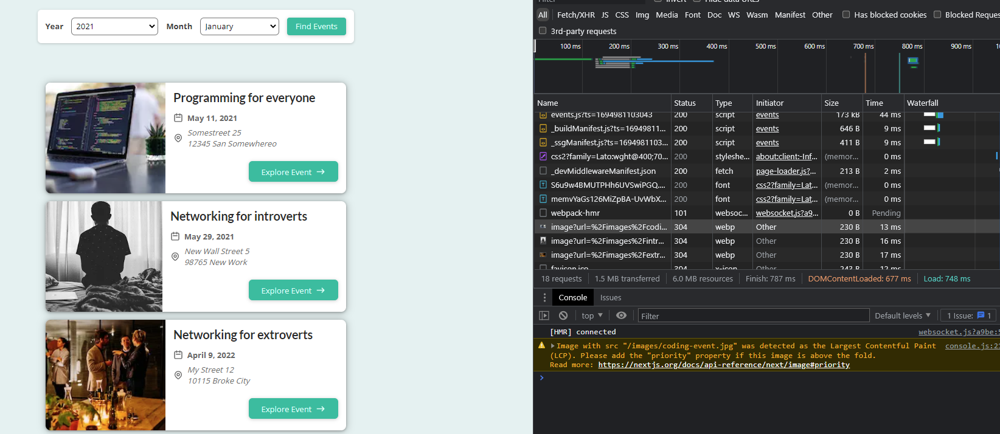

# NextJS

### [Docs](https://nextjs.org/docs)

## File Based Routing

- NextJS uses file based routing
- Each file inside the pages directory becomes a route
- We can nest files inside the pages directory to create nested routes
- We can use the Link component from next/link to navigate between pages
- We can use the useRouter hook from next/router to get the current route
- We can use the withRouter HOC from next/router to inject the router object into the component's props

---

## Dynamic Routes

- We can create dynamic routes by adding brackets to a page name
  > i.e. `pages/[projectid].js`

**Extracting Dynamic Route Data**

- We can extract dynamic route data by using the useRouter hook from next/router

```js
const router = useRouter();
```

> This gives us a router object with useful properties and methods

**Catchall Routes**

- we can create catchall (for multiple dynamic segments) routes by prepending three dots to the file name
  > i.e. `pages/[...projectid].js`

**Link Component**

- We can use the Link component from next/link to navigate between pages

```js
import Link from "next/link";
function HomePage() {
  return (
    <div>
      <h1>The Home Page</h1>
      <ul>
        <li>
          <Link href="/portfolio">Portfolio</Link>
        </li>
        <li>
          <Link href="/clients">Clients</Link>
        </li>
        <li>
          <Link href="/about">About</Link>
        </li>
        <li>
          <Link href="/portfolio/1">Portfolio Project 1</Link>
        </li>
      </ul>
    </div>
  );
}
export default HomePage;
```

---

### Imperative (Programatic) Navigation

- We can use the router object from next/router to navigate imperatively using `router.push()`

```js
import { useRouter } from "next/router";
function ClientProjectsPage() {
  const router = useRouter();

  function loadProjectHandler() {
    // load data...
    router.push("/clients/max/projecta");
  }

  return (
    <div>
      <h1>The Projects of a Given Client</h1>
      <button onClick={loadProjectHandler}>Load Project A</button>
    </div>
  );
}
export default ClientProjectsPage;
```

**Serving static files** _static files like images must be placed in the public folder_

---

**Icons SVG** _[Hero Icons](https://heroicons.com/)_

---

### Page Pre-Rendering

- NextJS pre-renders pages by default
- Pre-rendering generates HTML for each page in advance
- Pre-rendering can be done in two ways:
  - **Static Generation** (Recommended): The HTML is generated at build time and will be reused on each request
  - **Server-side Rendering**: The HTML is generated on each request

**getStaticProps** _Static Generation... must return an object that will then get fed into your component as props_

```js
export async function getStaticProps() {
  return {
    props: {
      products: [],
    },
  };
}
```

**getStaticProps** is executed at build time and is not exposed to the client side, you can run code that wouldn't be possible on the client side like accessing the file system.

- When you import the fs module to use in `getStaticProps` next is smart enough to seperate your code so it doesn't get bundled with the client side code.

```js
const filePath = path.join(process.cwd(), "data", "dummy-data.json");
const products = await fs.readFileSync(filePath);
```

`process.cwd()` gives you the current working directory

` const filePath = path.join(process.cwd(), "data", "dummy-data.json")` builds an absolute path to the dummy-data.json file

**Incremental Static Generation** _regenerate the page on the server after the initial request comes in_

- runs getStaticProps on the server after the initial request comes in... rather than just at build time...

> Pre-generate page then re-generate it on the server on every request at most every X seconds then either serve the old page or the new page depending on the request

**To do this you set a time in seconds on the revalidate key of the object returned by getStaticProps**

```js
export async function getStaticProps() {
  const filePath = path.join(process.cwd(), "data", "dummy-backend.json");
  const jsonData = await fs.readFile(filePath);
  const data = JSON.parse(jsonData);
  return {
    props: {
      products: data.products,
    },
    revalidate: 10,
  };
}
```

- the code above tells next that for this page the data should be revalidated on every request unless it's been less than 10 seconds since the last request.

- In development the page is refreshed on every request regardless of the revalidate value.

**getStaticProps Context** _context object that is passed to getStaticProps_

- context object has a params key that contains the dynamic route parameters for the page

**Other keys in the object returned by getStaticProps**

- notFound: true... tells next that the page should return a 404 page

  - could be used for instance if the data fetching in getStaticProps fails... you could return a 404 page

- redirect: `{ destination: "/redirect-page" }`... tells next to redirect to the page specified in the destination key

```js
export async function getStaticProps(context) {
  const filePath = path.join(process.cwd(), "data", "dummy-backend.json");

  const jsonData = await fs.readFile(filePath);
  const data = JSON.parse(jsonData);
  if (!data) {
    return {
      redirect: {
        destination: "/no-data",
      },
    };
  }

  if (data.products.length === 0) {
    return { notFound: true };
  }

  return {
    props: {
      products: data.products,
    },
    revalidate: 10,
  };
}
```

**Context Object** _context object that is passed to getStaticProps_

- context object has a params key that contains the dynamic route parameters for the page

**Pre-Generated Paths** _getStaticPaths_

- getStaticPaths is used to tell next which dynamic routes it should pre-generate
- getStaticPaths is used in conjunction with getStaticProps

**getStaticPaths fallback key**

```js
export async function getStaticPaths() {
  return {
    paths: [
      { params: { pid: "p1" } },
      { params: { pid: "p2" } },
      { params: { pid: "p3" } },
      { params: { pid: "p4" } },
      { params: { pid: "p5" } },
      { params: { pid: "p6" } },
      { params: { pid: "p7" } },
      { params: { pid: "p8" } },
      { params: { pid: "p9" } },
      { params: { pid: "p10" } },
    ],
    fallback: true,
  };
}
```

- fallback: true... tells next that if a page is not pre-generated it should try to generate it on the server, just in time, when the request comes in.
- fallback: false... tells next that if a page is not pre-generated it should return a 404 page
- fallback: "blocking"... tells next that if a page is not pre-generated it should try to generate it on the server, just in time, when the request comes in. The difference between this and fallback: true is that the user will see a loading indicator while the page is being generated on the server.

- When fallback is set to true you should be prepared to render a fallback UI while the page is being generated from your component.

###### Loading Paths Dynamically

```js
import { Fragment } from "react";
import fs from "fs/promises";
import path from "path";

function ProductDetailPage(props) {
  const { loadedProduct } = props;
  if (!loadedProduct) {
    return <p>Loading...</p>;
  }
  return (
    <Fragment>
      <h1>{loadedProduct.title}</h1>
      <p>{loadedProduct.description}</p>
    </Fragment>
  );
}
async function getData() {
  const filePath = path.join(process.cwd(), "data", "dummy-backend.json");

  const jsonData = await fs.readFile(filePath);
  const data = JSON.parse(jsonData);
  return data;
}

export async function getStaticProps(context) {
  const { params } = context;
  const productId = params.pid;

  const data = await getData();

  const product = data.products.find((product) => product.id === productId);

  return {
    props: {
      loadedProduct: product,
    },
    revalidate: 10,
  };
}

export async function getStaticPaths() {
  const data = await getData();
  const ids = data.products.map((product) => product.id);
  const pathsWithParams = ids.map((id) => {
    return { params: { pid: id } };
  });
  return {
    paths: [...pathsWithParams],
    fallback: "blocking",
  };
}
export default ProductDetailPage;
```

**getStaticProps and getStaticPaths** _work together (static generation... pre generated pages) but you only need get static paths for dynamic pages named with [] bracket notation_

**getStaticProps** _does not have access to incomming requests_

**getServerSideProps** _Server Side Rendering... runs on the server for every request... must return an object that will then get fed into your component as props_

> sometimes you need to pre-render for every request or you need access to the request object (e.g. cookies)
> `export async function getServerSideProps(context) {...}`

**When running `npm run build`** _next will pre-render all pages that have getStaticProps or getStaticPaths... the lambda symbol `λ` is not pre-generated it will instead be generated on the server for every request_

---

### Client Side Data Fetching

- Some data doesn't need to be pre-rendered (i.e. ata that changes with high frequency like stock prices)
- Another example would be highly user-specific data like a user's shopping cart

---

### When To Use getStaticProps vs getServerSideProps vs Client Side Data Fetching

- getStaticProps: When you need to pre-render a page and the data required to pre-render the page is available at build time ahead of a user's request
- getServerSideProps: When you need to pre-render a page and the data required to pre-render the page is NOT available at build time ahead of a user's request
- Client Side Data Fetching: When you need to fetch data at request time instead of at build time

---

### The `<Head>` Component

- The `<Head>` component from next/document allows you to add meta data to the head of the page

**The `_app.js` File**

- The `_app.js` file is used to override the default `App` component that is used by NextJS

```js
import Layout from "../components/layout/layout";
import "../styles/globals.css";

function MyApp({ Component, pageProps }) {
  return (
    <Layout>
      <Component {...pageProps} />
    </Layout>
  );
}

export default MyApp;
```

- In the code above we are wrapping the Component that is being rendered with our own Layout component (which provides the navigation bar)
- We can use this same approach to add other components that we want to be rendered on every page (i.e a Head component)

```js
import Layout from "../components/layout/layout";
import "../styles/globals.css";
import Head from "next/head";

function MyApp({ Component, pageProps }) {
  return (
    <Layout>
      <Head>
        <meta name="viewport" content="initial-scale=1.0, width=device-width" />
      </Head>
      <Component {...pageProps} />
    </Layout>
  );
}

export default MyApp;
```

**NextJs Merges Head Components**

- If you have multiple Head components in your application NextJS will merge them into one Head component
- This means that if you provide the same tag in the head component in multiple places (for example `<title>`) the last one will win.

```js
import Layout from "../components/layout/layout";
import "../styles/globals.css";
import Head from "next/head";

function MyApp({ Component, pageProps }) {
  return (
    <Layout>
      <Head>
        <title>Next Events</title>
        <meta name="description" content="NextJS Events" />
        <meta name="viewport" content="initial-scale=1.0, width=device-width" />
      </Head>
      <Component {...pageProps} />
    </Layout>
  );
}
export default MyApp;
```

- In the example above the title and description meta tags will be overwritten by the Head component where it exists in other pages.

**The \_document.js File**

```js
import Document, { Html, Head, Main, NextScript } from "next/document";
class MyDocument extends Document {
  render() {
    return (
      <Html lang="en">
        <Head />
        <body>
          <div id="overlays"></div>
          <Main />
          <NextScript />
        </body>
      </Html>
    );
  }
}
export default MyDocument;
```

- In the code above we can add a div with an id of overlays that will be rendered on every page...

---

### Image Optimization

- When we use the image component, next will create multiple versions of the image (on the fly) and serve the most appropriate version to the user based on their device size and screen resolution. Then those images will be cached for future requests.

```js
import Image from "next/image";
//...
<Image src={"/" + image} alt={title} width={250} height={160} />;
```

- another thing to note is that previously all the images were loaded eagerly, however the image component will only load the images that are visible on the screen (lazily) improving performance.

> As you can see here... because I am using chrome these images are being served as webp images which are smaller than the jpg images that are being served to firefox
> 
